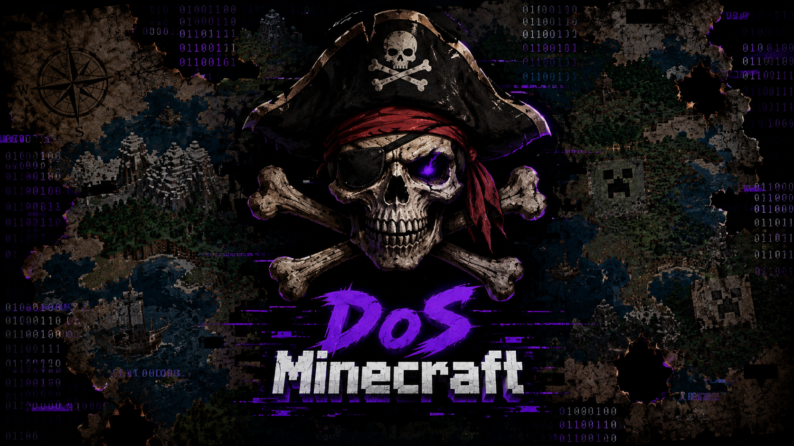

# Minecraft Connection Tester

O **Minecraft Connection Tester** é uma aplicação desktop desenvolvida para realizar testes de conexões com servidores do **Minecraft Java Edition**, utilizando o protocolo de rede da versão **1.12.2**.

O projeto utiliza **Rust e Tauri** em seu backend, com **Tokio** para o gerenciamento assíncrono das conexões. A interface da aplicação é desenvolvida utilizando **TypeScript e Vite**.

## Demonstração

## Como funciona

A aplicação estabelece conexões **TCP** diretamente com o servidor informado pelo usuário. Após estabelecer a conexão, o programa realiza o processo inicial de comunicação utilizando o protocolo de rede do Minecraft.

Primeiramente, é estabelecida a conexão TCP. Em seguida, a aplicação envia um **Handshake** informando ao servidor que está utilizando o protocolo do Minecraft Java 1.12.2. Depois disso, é enviado o pacote **Login Start**, iniciando o processo de login do cliente.

Após a conexão ser estabelecida, a aplicação consegue interpretar determinados pacotes enviados pelo servidor, incluindo os pacotes **Keep Alive**. Quando recebe um Keep Alive, o cliente responde de acordo com o protocolo, permitindo que a conexão permaneça ativa durante o teste.

O projeto também permite manter várias conexões simultaneamente. Cada conexão é executada de forma assíncrona e independente, utilizando o runtime Tokio, permitindo que diversas conexões sejam gerenciadas ao mesmo tempo.

## Protocolo Minecraft

A implementação atual utiliza o **protocolo 340**, correspondente ao **Minecraft Java Edition 1.12.2**.

Por esse motivo, o projeto não funciona como um testador genérico de conexões TCP. Embora o TCP seja utilizado como meio de transporte, os dados enviados pela aplicação seguem especificamente o protocolo de comunicação do Minecraft.

Isso significa que conectar a aplicação a uma porta HTTP, SSH, FTP ou outro serviço TCP não fará com que ela se comunique corretamente com esse serviço. O conteúdo enviado pela aplicação foi desenvolvido para ser interpretado por um servidor Minecraft compatível.

Servidores Minecraft de outras versões podem apresentar incompatibilidades, pois o protocolo de rede é alterado ao longo das versões. Servidores que utilizam sistemas de compatibilidade de protocolo, como determinados proxies ou plugins, podem aceitar conexões de versões diferentes dependendo da configuração.

O projeto atualmente é voltado para **Minecraft Java Edition** e não possui suporte ao protocolo utilizado pelo **Minecraft Bedrock Edition**.

## Backend

O backend, desenvolvido em Rust, é responsável por toda a parte de comunicação de rede da aplicação. Ele cria as conexões TCP, constrói os pacotes do protocolo Minecraft, envia o Handshake e o Login Start, interpreta os dados recebidos do servidor e processa os pacotes necessários para manter as conexões ativas.

O uso do **Tokio** permite que as conexões sejam executadas de maneira assíncrona, possibilitando o gerenciamento de várias conexões simultaneamente sem bloquear a aplicação.

O **Tauri** é utilizado para conectar o frontend ao backend Rust e transformar o projeto em uma aplicação desktop.

## Objetivo

O objetivo do projeto é fornecer uma ferramenta para **testes controlados de conexões e estudos sobre o funcionamento do protocolo de rede do Minecraft**.

A aplicação não pretende ser um cliente Minecraft completo. Ela implementa apenas as partes do protocolo necessárias para estabelecer e manter as conexões utilizadas durante os testes.

O projeto não possui sistemas completos de gameplay, como renderização do mundo, carregamento de chunks, movimentação de jogadores, inventário, chat, entidades ou sincronização completa do estado do jogo.

Use a aplicação somente em servidores e infraestruturas que você possui ou para os quais tenha autorização para realizar testes.
